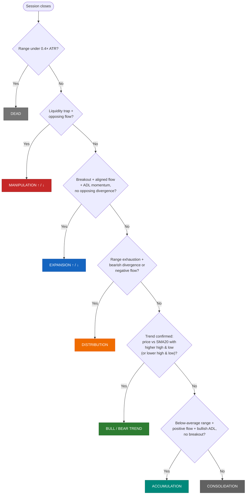

# Multi-Session Liquidity Indicator

**A Pine Script v6 overlay for TradingView that maps session liquidity, tracks market structure, and classifies real-time market bias across five global trading sessions.**

[Overview](#overview) · [Features](#features) · [How It Works](#how-it-works) · [Bias Engine](#the-bias-engine) · [Installation](#installation) · [Settings](#settings-reference) · [Disclaimer](#disclaimer)

---

## Overview

- 🗺️ **Session Engine** — live range boxes, liquidity lines, and midlines across five global sessions
- 🧠 **Bias Engine** — rule-based market-phase classification: trend, expansion, accumulation, distribution, manipulation, or consolidation
- 🎯 **Macro Liquidity** — automatic PDH/PDL and PWH/PWL reference levels
- 📊 **Live Dashboard** — a top-right table reading out phase, liquidity, volatility, and range for every session

**Multi-Session Liquidity Indicator** — published on TradingView as *"Arpan's Trading Sessions"* — is an overlay indicator that maps how price behaves across the five major global trading sessions: **Sydney, Tokyo, Shanghai, London, and New York**.

On top of the session boxes and liquidity lines, it runs a rule-based **bias engine** that reads range, volatility, and volume-flow data and classifies every completed session into a market phase, then reports the result through a live on-chart dashboard.

It's built for traders who work with session-liquidity / market-structure concepts — premium-discount, liquidity sweeps, session highs and lows — and want that read automated instead of marked up by hand.

## Preview

  

<em>Session boxes, liquidity lines, and the live bias dashboard in action.</em>

## Features

### Session Range Boxes
- Auto-drawn high/low boxes for **Sydney, Tokyo, Shanghai, London, and New York**, redrawn live as each session develops.
- Optional **merge mode** combines Sydney + Tokyo + Shanghai into a single "Asian" box.
- Per-box labels, adjustable background opacity, and solid / dashed / dotted borders.

### Session Liquidity Lines
- **Midlines** — a dashed equilibrium (premium/discount) line at the 50% level of each session's range, with an optional live price label.
- **High/low lines** — solid lines marking each session's extremes, with optional price labels.
- **Carry-forward** — extends the previous session's high/low lines until the next session begins, so liquidity levels stay visible between sessions.

> *The Asian midline and high/low lines are always built from the combined Sydney + Tokyo + Shanghai window — "Merge Asian Box" only changes how the range **boxes** are drawn, not the liquidity lines.*

### Macro Liquidity Levels
- **PDH / PDL** — Previous Day High / Low.
- **PWH / PWL** — Previous Week High / Low.
- Plotted as extended reference lines with live price labels.

### Bias Engine
A rule-based classifier ([details below](#the-bias-engine)) that scores every completed session on four dimensions:

| Dimension | What it captures |
|---|---|
| **Market Phase** | Trend, Expansion, Accumulation, Distribution, Manipulation, Consolidation, or Dead |
| **Liquidity** | Stop-hunt / liquidity-trap detection above or below the session range |
| **Volatility** | Candle range vs. `ATR(14)` — Dead, Normal, High, Extreme |
| **Range** | Session range vs. its own rolling average — Tight, Normal, Large, Extreme |

### Live Multi-Session Dashboard
- A table (top-right) summarizing **Asian / Europe / USA** sessions across all four Bias Engine dimensions, color-coded and updated every bar.
- Holds the last completed session's read-out on screen until the next session takes over.

Example output:

| Session | Market Phase | Liquidity | Volatility | Range |
|---|---|---|---|---|
| Asian | BULL TREND | NONE | HIGH | LARGE |
| Europe | EXPANSION ↑ | TRAP LOW | EXTREME | EXTREME |
| USA | CONSOLIDATION | NONE | NORMAL | NORMAL |

### Historical Bias Labels
- Prints the resolved market phase above every past session box, so you can scroll back through history and see how the engine read prior sessions.

### UI & Customization
- Full control over box opacity, borders, labels, and which sessions/lines are shown — 25+ inputs across five organized setting groups.

## How It Works

The script is organized into four cooperating modules — the same four called out in the codebase's own `ENGINE 1`–`ENGINE 4` comments:

| Module | Core Function(s) | Responsibility |
|---|---|---|
| **Session Engine** | `draw_box()`, `draw_liquidity_lines()` | Builds each session's range box and plots its midline / high-low liquidity lines in real time |
| **Bias Engine** | `get_ultra_bias()` | Runs the four-dimension classifier — phase, liquidity, volatility, range — on every completed session |
| **Macro Liquidity** | `request.security()` (`D` / `W`) | Pulls the prior day's and prior week's high/low for PDH/PDL and PWH/PWL |
| **Dashboard** | `table.new()` / `table.cell()` on `barstate.islast` | Renders the live top-right summary table and holds the last completed session's read-out |

Each module tracks its own state with persistent (`var`) variables, so session ranges, rolling averages, and dashboard values update incrementally on every bar instead of being recomputed from scratch — the standard lightweight pattern for real-time drawing objects in Pine Script.

## The Bias Engine

Each completed session is scored by `get_ultra_bias()`, which combines several independent layers of logic:

**1. Smart-money flow.** A custom money-flow oscillator (`admf`) built from the close-to-close change over true range, weighted by `volume × hlc3`, smoothed with an `RMA(14)`, and normalized against a 20-period average volume. It's paired with a classic Accumulation/Distribution Line (9/15 SMA crossover) for momentum confirmation, and a 20-bar lookback that flags bullish/bearish divergence between price and flow.

**2. Volatility layer** — candle range compared against `ATR(14)`:

| Label | Condition |
|---|---|
| `DEAD` | range < 0.4 × ATR |
| `NORMAL` | default |
| `HIGH` | range > 1.2 × ATR |
| `EXTREME` | range > 2 × ATR |

**3. Range layer** — the completed session's total range compared against its own rolling average (`Range Average Length` input, default 12 sessions):

| Label | Condition |
|---|---|
| `TIGHT` | ratio < 0.5 |
| `NORMAL` | ratio < 1.0 |
| `LARGE` | ratio < 1.3 |
| `EXTREME` | ratio ≥ 1.3 |

**4. Liquidity events.** A `TRAP HIGH` / `TRAP LOW` flag fires when price wicks through a session's high or low and closes back inside it by more than half that candle's range — a stop-hunt / liquidity-grab signature.

### Decision Priority

These four layers feed a priority-ordered decision tree — **Dead → Manipulation → Expansion → Distribution → Trend → Accumulation → Consolidation** — evaluated top to bottom, stopping at the first condition that matches:

- **Expansion** needs a directional breakout *and* aligned smart-money flow *and* ADL momentum *and* no opposing divergence.
- **Manipulation** needs a liquidity trap *and* flow already leaning against the trapped side.
- **Distribution** needs range exhaustion, plus either bearish divergence or negative flow.
- **Accumulation** needs a below-average range *and* positive flow *and* bullish ADL momentum with no breakout.
- Anything that clears none of the above resolves to **Consolidation**.

## Session Times

All sessions use Pine Script's timezone-aware `time()` call, so they auto-adjust for daylight saving in their local region — no manual DST handling needed.

| Session | Local Hours | Timezone |
|---|---|---|
| 🇦🇺 Sydney | 10:00 – 16:00 | `Australia/Sydney` |
| 🇯🇵 Tokyo | 09:00 – 15:00 | `Asia/Tokyo` |
| 🇨🇳 Shanghai | 09:30 – 15:00 | `Asia/Shanghai` |
| 🇬🇧 London | 08:00 – 16:30 | `Europe/London` |
| 🇺🇸 New York | 09:30 – 16:00 | `America/New_York` |

> Session hours are fixed in the script rather than exposed as settings, to keep the inputs panel focused. To use different hours, edit the `_session` / `_tz` variables near the top of the `.pine` file.

## Installation

**Requirements**
- A free or paid [TradingView](https://www.tradingview.com/) account
- Any symbol, any intraday timeframe — session boxes are clearest at 1H and below

**Steps**
1. Open any chart on [TradingView](https://www.tradingview.com/).
2. Open the **Pine Editor** panel at the bottom of the screen.
3. Clear the default template and paste in the full contents of this indicator's `.pine` file.
4. Click **Add to Chart**.
5. Open the indicator's **⚙ Settings** to toggle sessions, boxes, lines, and dashboard components to your liking.

Alternatively, since it's published publicly as *"Arpan's Trading Sessions,"* you can search that name directly in TradingView's Indicators & Strategies search bar and add it without copy-pasting.

## Settings Reference

<strong>Session Boxes</strong>

 

| Input | Default | Description |
|---|---|---|
| Show Sydney Box | `true` | Toggle the Sydney session's range box |
| Show Tokyo Box | `true` | Toggle the Tokyo session's range box |
| Show Shanghai Box | `true` | Toggle the Shanghai session's range box |
| Merge Asian Box (Syd+Tok+Sha) | `false` | Draw one combined "Asian" box instead of three separate ones |
| Show London Box | `true` | Toggle the London session's range box |
| Show New York Box | `true` | Toggle the New York session's range box |

<strong>Session Lines</strong>

 

| Input | Default | Description |
|---|---|---|
| Show Asian Session Midline | `true` | Draw the 50% equilibrium line for the combined Asian session |
| Show Europe Session Midline | `true` | Draw the 50% equilibrium line for the London session |
| Show USA Session Midline | `true` | Draw the 50% equilibrium line for the New York session |
| Show Asian Session High/Low | `true` | Draw solid high/low liquidity lines for the Asian session |
| Show Europe Session High/Low | `true` | Draw solid high/low liquidity lines for the London session |
| Show USA Session High/Low | `true` | Draw solid high/low liquidity lines for the New York session |

<strong>Macro Liquidity</strong>

 

| Input | Default | Description |
|---|---|---|
| Show Previous Daily High/Low (PDH/PDL) | `true` | Plot yesterday's high and low as extended reference lines |
| Show Previous Weekly High/Low (PWH/PWL) | `true` | Plot last week's high and low as extended reference lines |

<strong>UI & Aesthetics</strong>

 

| Input | Default | Description |
|---|---|---|
| Background Opacity (0–100) | `97` | Transparency of the box fill — higher is more transparent |
| Show Box Borders | `true` | Toggle borders on session boxes |
| Border Style | `Solid` | `Solid`, `Dashed`, or `Dotted` box border style |

<strong>Advanced Features</strong>

 

| Input | Default | Description |
|---|---|---|
| Show Box Labels | `true` | Toggle the session-name label at the top of each box |
| Show Smart Range Dashboard | `true` | Displays a clean table in the corner with range intelligence |
| Show Historical Bias Labels | `true` | Prints the session state above past boxes for backtesting |
| Range Average Length (Days) | `12` | Number of past sessions used to compute each session's rolling range average |
| Show Premium/Discount Midline | `true` | Draws a dashed equilibrium line at 50% of the session range |
| Show Midline Price Label | `true` | Displays the exact price value next to the midline |
| Show Session High/Low Lines | `true` | Draws lines at the session extremes |
| Show Price on H/L Lines | `true` | Displays the exact price value next to the high/low lines |
| Carry Forward Previous H/L | `true` | Extends the high/low liquidity lines until the start of the next session |

## Technical Notes

- Pine Script **v6**, single-file overlay indicator.
- The session engine (boxes, lines, dashboard) runs entirely on real-time bar data — no `request.security()` calls, so no higher-timeframe repainting risk there.
- The only `request.security()` calls are `PDH/PDL/PWH/PWL`, which pull already-closed `[1]` values with `lookahead_on` — the standard safe pattern for referencing a prior, fixed higher-timeframe bar.
- Drawing limits: `max_boxes_count = 5000`, `max_lines_count = 500`, `max_labels_count = 500`, `max_bars_back = 5000`.

## Contributing

Issues and pull requests are welcome.

1. Fork the repo and branch off `main`.
2. Make your changes in the `.pine` file.
3. Test on a live or replay chart across a few symbols/timeframes.
4. Open a pull request describing what changed and why — if it touches Bias Engine logic, a chart screenshot of the scenario helps a lot.

## Disclaimer

This indicator is provided for **educational and informational purposes only** and does not constitute financial advice. It is a technical-analysis tool built on historical price, volume, and range data — it does not predict future price movement. Always backtest thoroughly and use sound risk management before trading with real capital.

## License

Licensed under the [MIT License](LICENSE).

## Author

Built by **Arpan** — [GitHub @Arpan01574](https://github.com/Arpan01574)

---

⭐ If this indicator is useful to you, consider starring the repo — it helps others find it too.

