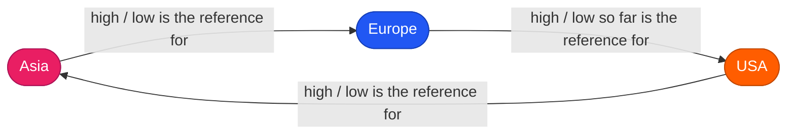
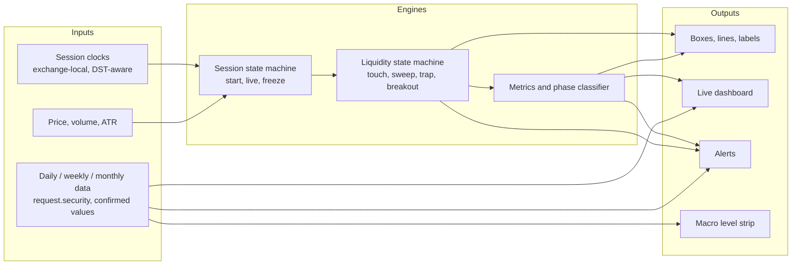
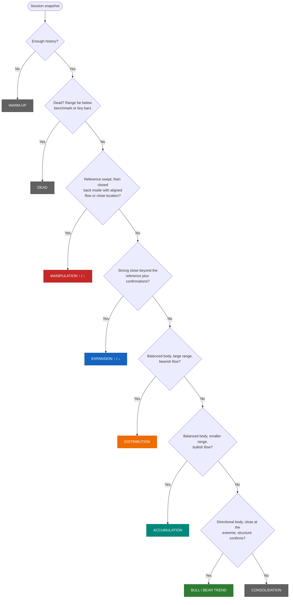

<a id="readme-top"></a>

<div align="center">


<br>

# Multi-Session Liquidity Indicator

**Session ranges, liquidity sweeps and rule-based market-phase bias, mapped live across Sydney, Tokyo, Shanghai, London and New York.**

Published on TradingView as **Arpan's Trading Sessions** · Pine Script v6 · MIT licensed

[](https://www.tradingview.com/pine-script-docs/)
[][tradingview]
[](LICENSE)

[](https://github.com/Arpan01574/Multi-Session-Liquidity-Indicator/stargazers)
[](https://github.com/Arpan01574/Multi-Session-Liquidity-Indicator/commits)
[](https://github.com/Arpan01574/Multi-Session-Liquidity-Indicator/issues)
[](https://github.com/Arpan01574/Multi-Session-Liquidity-Indicator/pulls)

[Quick Start](#quick-start) · [Features](#features) · [Architecture](#architecture) · [Bias Engine](#the-bias-engine) · [Alerts](#alerts) · [Settings](#settings-reference) · [FAQ](#faq)

</div>

---

## Overview

A session box shows where price has traded. This indicator goes a step further: it tracks which session highs and lows have been **taken**, how price reacted when they were, and condenses the result into a live, rule-based read-out of **phase, liquidity state, range, volatility, flow and bias**, on a dashboard that updates with every tick.

It is built for traders who work with session-liquidity and market-structure ideas such as premium/discount, liquidity sweeps, session highs and lows, and killzones, and who want that read automated instead of marked up by hand.

<table>
  <tr>
    <td width="33%" valign="top">
      <b>🗺️ Session Engine</b><br>
      Live range boxes, midlines and high/low lines for five sessions. Exchange-local hours, DST-aware, fully editable.
    </td>
    <td width="33%" valign="top">
      <b>🧲 Liquidity Engine</b><br>
      Tracks every reference high/low from <i>touched</i> to <i>swept</i> to <i>trap</i> or <i>breakout</i>, with four sweep definitions and lines that stop where they are taken.
    </td>
    <td width="33%" valign="top">
      <b>🧠 Bias Engine</b><br>
      Classifies each session into one of ten market phases, with thresholds and confirmation layers you control.
    </td>
  </tr>
  <tr>
    <td valign="top">
      <b>🎯 Macro Levels</b><br>
      PDH/PDL, PWH/PWL, PMH/PML, daily/weekly/monthly opens and the NY midnight open, in a clean strip beside the last candle.
    </td>
    <td valign="top">
      <b>📊 Live Dashboard</b><br>
      Asia, Europe and USA plus a DAY row. Three detail levels, eight positions, dark/light/auto themes.
    </td>
    <td valign="top">
      <b>🔔 Alerts</b><br>
      Ten ready-made conditions plus event alerts for phase changes, sweeps, manipulation, expansion and breakout acceptance.
    </td>
  </tr>
</table>

### At a glance

| Spec | Details |
|---|---|
| **Platform** | TradingView · Pine Script v6 · overlay indicator |
| **Timeframes** | Intraday charts up to 4H (clearest on 1H and below) |
| **Markets** | Any symbol with intraday data |
| **Sessions** | Sydney · Tokyo · Shanghai · London · New York, plus a combined Asia window |
| **Market phases** | 10, plus FORMING / WARM-UP / N/A status flags |
| **Alerts** | 10 ready-made conditions + event alerts via `alert()` |
| **Configuration** | 150+ inputs in 9 groups |
| **External data** | None. Three higher-timeframe requests (D / W / M) |
| **License** | MIT |

## Preview

<p align="center">
  
</p>
<p align="center"><em>Session boxes, liquidity lines, macro levels and the live dashboard on a TradingView chart.</em></p>

Example dashboard read-out (Standard detail level, illustrative values):

| SESSION | PHASE | LIQUIDITY | RANGE | % ADR | BIAS |
|---|---|---|---|---|---|
| ○ Asia | CONSOLIDATION | INSIDE | 28.0p  0.62× NORMAL | 35% | ◆ NEUTRAL |
| ● Europe | MANIPULATION ↑ | TRAP LOW | 56.0p  1.06× LARGE | 70% | ▲ BULL |
| ● USA | EXPANSION ↑ | BREAKOUT ↑ | 86.0p  1.34× EXTREME | 108% | ▲ BULL |
| DAY | ▲ ABOVE DO | ABOVE PDH | ADR 80.0p | 112% used | EU US |

`●` marks a live session, `○` a completed one.

## Quick Start

**From TradingView:** search **Arpan's Trading Sessions** in the Indicators menu (or [find it on TradingView][tradingview]) and click **Add to chart**.

**From source**

1. Open any **intraday** chart (4H or lower) on [TradingView](https://www.tradingview.com/).
2. Open the **Pine Editor** at the bottom of the screen, clear the default template and paste in the full contents of [`indicator.pine`](indicator.pine).
3. Click **Add to chart**.
4. Open the indicator's **Settings** and switch on the sessions, lines, macro levels and dashboard columns you want. The defaults are a good starting point.

> [!TIP]
> Macro levels (PDH/PDL, PWH/PWL, opens) are drawn in a strip to the right of the last candle. Drag the chart to the left to leave empty space on the right and the strip comes into view. Prefer lines across the whole chart? Set **Macro Liquidity → Layout** to *Full line from period start*.

## Features

### Session engine

- **Five sessions, one clock each.** Sydney, Tokyo, Shanghai, London and New York are evaluated in their own exchange timezone, so daylight-saving changes need no manual handling. Hours, colors and visibility are editable per session.
- **Live range boxes.** Each box grows with its session and carries a label with its range and its size against the recent benchmark, for example `London · 56.0p · 1.1×`.
- **Merge mode.** Collapse Sydney + Tokyo + Shanghai into a single Asian box.
- **Midlines and high/low lines.** A 50% equilibrium line and solid session extremes for Asia, Europe and USA, with optional price labels.
- **Smart carry-forward.** Previous highs and lows stay on the chart *until swept* (default), until the same session starts again, or not at all. A swept level is stopped and marked with ×.
- **Historical phase labels.** The resolved phase is printed under every completed session box.
- **History control.** Keep 1 to 100 sessions per session type. The script lowers the number automatically if it would exceed TradingView's 500-object limits and says so on the dashboard.
- **24/7 markets.** One switch hides weekend sessions for crypto.

> [!NOTE]
> The Asia midline and high/low lines are always built from the combined Sydney + Tokyo + Shanghai window. **Merge Asian box** only changes how the range *boxes* are drawn.

### Liquidity engine

Every Asia, Europe and USA session is judged against a **frozen reference high/low** taken from another session when it starts, never from its own developing range.


```mermaid
flowchart LR
    ASIA(["Asia"]) -->|"high / low is the reference for"| EUROPE(["Europe"])
    EUROPE -->|"high / low so far is the reference for"| USA(["USA"])
    USA -->|"high / low is the reference for"| ASIA
    classDef asia fill:#e91e63,stroke:#ad1457,color:#ffffff
    classDef eu fill:#2157f3,stroke:#1740b8,color:#ffffff
    classDef us fill:#ff5d00,stroke:#c24800,color:#ffffff
    class ASIA asia
    class EUROPE eu
    class USA us
```

- **Reference modes:** *Previous Macro Session* (default, the chain above), *Previous Same Session*, or *Both* (outer envelope of the two).
- **Four sweep definitions:** *Wick Through*, *Close Through*, *Wick + Rejection* and *Wick + Close Back Inside*, plus an optional minimum distance in ticks.
- **Level life cycle:** inside → touched → swept → **trap** or **breakout** → **accepted** or **failed** (with optional retest).
- **Breakout acceptance (optional):** require N consecutive closes beyond the level, a minimum distance and, if you like, a retest before a breakout counts as accepted.

| Liquidity label | Meaning |
|---|---|
| `INSIDE` | Price has stayed inside the reference range |
| `HIGH TOUCHED` / `LOW TOUCHED` | Level reached but not swept under the chosen definition |
| `SWEPT HIGH` / `SWEPT LOW` / `SWEPT H+L` | Liquidity taken on one or both sides |
| `TRAP HIGH` / `TRAP LOW` | Swept, then closed back inside on the reaction side (stop-hunt signature) |
| `BREAKOUT ↑` / `BREAKOUT ↓` | Close beyond the reference level |
| `RETEST ↑` / `RETEST ↓` | Breakout pulled back to the level (acceptance enabled) |
| `BRK ↑/↓ ACCEPTED` / `FAILED` | Closes held beyond the level, or came back inside |

When several apply, the label follows a fixed priority: accepted > failed > trap > retest > breakout > swept > touched > inside.

### Macro levels

- **Previous period highs and lows:** PDH/PDL, PWH/PWL and PMH/PML.
- **Opens:** Daily, Weekly, Monthly and the USA midnight open (00:00 New York).
- **Right-strip layout (default).** Lines start a set number of bars after the live candle and run to the price axis, so they never sit on top of candles. A full-line layout from the start of each period is also available.
- **Your style:** per-level colors, one line style for all or a per-level default (dashed previous-day, solid weekly/monthly, dotted opens), adjustable label position.
- **ADR.** The 14-day average daily range (adjustable) powers the `% ADR` column and the ADR alert.

### Live dashboard

A table on the last bar, refreshed on every tick. A new session appears on it from its very first bar.

| Detail level | Columns |
|---|---|
| **Compact** | SESSION · PHASE · LIQUIDITY · BIAS |
| **Standard** | + RANGE · % ADR |
| **Advanced** | + BAR VOL · FLOW · STRUCTURE |

The **DAY** row summarizes the day so far: position against the daily open and previous-day range, ADR used, bar volatility, the flow data mode in use, structure, and which sessions are active.

### Killzones and overlap

Optional background shading for the Europe × USA overlap and four killzones evaluated in New York time: Asia `20:00-23:59`, Europe `02:00-05:00`, USA AM `07:00-10:00` and Europe Close `10:00-12:00`. All editable, all off by default.

## Session Times

All sessions use Pine Script's timezone-aware `time()` calls, so they follow daylight saving in their own region.

| Session | Default hours (local) | Timezone | Default color |
|---|---|---|---|
| 🇦🇺 Sydney | 10:00 – 16:00 | `Australia/Sydney` | `#00c853` |
| 🇯🇵 Tokyo | 09:00 – 15:00 | `Asia/Tokyo` | `#e91e63` |
| 🇨🇳 Shanghai | 09:30 – 15:00 | `Asia/Shanghai` | `#9c27b0` |
| 🇬🇧 London | 08:00 – 16:30 | `Europe/London` | `#2157f3` |
| 🇺🇸 New York | 09:30 – 16:00 | `America/New_York` | `#ff5d00` |

The combined **Asia** window is the union of Sydney, Tokyo and Shanghai. Its box and lines use Tokyo's color. Every session's hours are editable in **Session Boxes**.

## Architecture


```mermaid
flowchart LR
    subgraph IN["Inputs"]
        T["Session clocks<br/>exchange-local, DST-aware"]
        P["Price, volume, ATR"]
        H["Daily / weekly / monthly data<br/>request.security, confirmed values"]
    end
    subgraph CORE["Engines"]
        SE["Session state machine<br/>start, live, freeze"]
        LE["Liquidity state machine<br/>touch, sweep, trap, breakout"]
        BE["Metrics and phase classifier"]
    end
    subgraph OUT["Outputs"]
        DR["Boxes, lines, labels"]
        DB["Live dashboard"]
        AL["Alerts"]
        ML["Macro level strip"]
    end
    T --> SE
    P --> SE
    SE --> LE --> BE
    LE --> DR
    BE --> DR
    BE --> DB
    BE --> AL
    LE --> AL
    H --> ML
    H --> DB
    H --> AL
```

| Layer | Responsibility | Key functions |
|---|---|---|
| Session detection | Timezone-aware session windows, weekend filter, timeframe gate | `f_in_sess` |
| Session state engine | Start → live → freeze, per-session range, flow, ATR and structure stats | `f_step`, `f_bar` |
| Liquidity state machine | Frozen references, sweep definitions, breakout acceptance, line life cycle | `f_ref`, `f_sweep_hit`, `f_ref_step`, `f_brk_step`, `f_sweeps` |
| Metrics and classifier | Range, body, close location, flow, then phase, liquidity and bias labels | `f_calc`, `f_classify`, `f_liq`, `f_live_eval` |
| Drawing engine | Create once, update with setters, delete when a session ages out | `f_create`, `f_update`, `f_del` |
| Macro levels | Previous-period levels and opens from D / W / M data | `request.security`, `f_lvl` |
| Dashboard | Table rendered on the last bar, refreshed every tick | `f_dash_row`, `f_dash_day` |
| Alerts | Fixed conditions plus a queued event stream | `alertcondition`, `f_ev`, `alert` |

### Data integrity

- The range benchmark is built from **prior completed sessions only**, never from the session being classified.
- Reference levels are **frozen when a session starts** and read before the new bar updates any session, so a session can never become its own reference.
- Previous-period levels (PDH/PDL, PWH/PWL, PMH/PML) use the **last completed** higher-timeframe bar (`[1]` with `lookahead_on`). Opens are known at the start of their period.
- Divergence uses **confirmed pivots** by default: the signal arrives late but never repaints.
- Developing values are meant to develop. The dashboard and the "% ADR used" figure are live by design, while a session's final classification is made once, when it ends.

## The Bias Engine

Each session is measured on range against a benchmark, body size, close location, volume-weighted money flow, ADR use and bar volatility. Together with its liquidity state, those measurements are run through a priority-ordered decision tree. It evaluates top to bottom and stops at the first match:


```mermaid
flowchart TD
    S(["Session snapshot"]) --> Q0{"Enough history?"}
    Q0 -->|"No"| R0["WARM-UP"]
    Q0 -->|"Yes"| Q1{"Dead? Range far below<br/>benchmark or tiny bars"}
    Q1 -->|"Yes"| R1["DEAD"]
    Q1 -->|"No"| Q2{"Reference swept, then closed<br/>back inside with aligned<br/>flow or close location?"}
    Q2 -->|"Yes"| R2["MANIPULATION ↑ / ↓"]
    Q2 -->|"No"| Q3{"Strong close beyond the<br/>reference plus confirmations?"}
    Q3 -->|"Yes"| R3["EXPANSION ↑ / ↓"]
    Q3 -->|"No"| Q4{"Balanced body, large range,<br/>bearish flow?"}
    Q4 -->|"Yes"| R4["DISTRIBUTION"]
    Q4 -->|"No"| Q5{"Balanced body, smaller range,<br/>bullish flow?"}
    Q5 -->|"Yes"| R5["ACCUMULATION"]
    Q5 -->|"No"| Q6{"Directional body, close at the<br/>extreme, structure confirms?"}
    Q6 -->|"Yes"| R6["BULL / BEAR TREND"]
    Q6 -->|"No"| R7["CONSOLIDATION"]

    classDef neutral fill:#616161,stroke:#424242,color:#ffffff
    classDef manip fill:#c62828,stroke:#8e0000,color:#ffffff
    classDef exp fill:#1565c0,stroke:#0d47a1,color:#ffffff
    classDef dist fill:#ef6c00,stroke:#e65100,color:#ffffff
    classDef acc fill:#00897b,stroke:#00695c,color:#ffffff
    classDef trend fill:#2e7d32,stroke:#1b5e20,color:#ffffff
    class R0,R1,R7 neutral
    class R2 manip
    class R3 exp
    class R4 dist
    class R5 acc
    class R6 trend
```

### Phase reference (default thresholds)

| Phase | Bias | Trigger |
|---|---|---|
| `DEAD` | Neutral | Range below 0.40× benchmark, or average bar range below 0.50× ATR. Not applied while a session is still forming |
| `MANIPULATION ↓` | Bearish | Reference high swept and the session closes back below it in the lower half of its range, with bearish flow or a close in the bottom 30% |
| `MANIPULATION ↑` | Bullish | Reference low swept and the session closes back above it in the upper half of its range, with bullish flow or a close in the top 30% |
| `EXPANSION ↑` | Bullish | Close above the reference high, body at least 50% of range, close in the top 35%, bullish flow, plus any confirmations you enabled |
| `EXPANSION ↓` | Bearish | Mirror image below the reference low |
| `DISTRIBUTION` | Bearish | Balanced body (under 40% of range), range at or above LARGE (1.0× benchmark), bearish flow |
| `ACCUMULATION` | Bullish | Balanced body, range below LARGE, bullish flow |
| `BULL TREND` / `BEAR TREND` | Bullish / Bearish | Body at least 50% of range, closing in the trend direction near the extreme, structure (HH/HL or LH/LL run) confirms |
| `CONSOLIDATION` | Neutral | Nothing above matched |
| `FORMING` | n/a | A live session that has only just started and does not match a phase yet |
| `WARM-UP` | n/a | Fewer completed sessions than **Min historical sessions required** |
| `N/A` | n/a | Session rejected as unreliable (partial, too few bars, or low data quality) |

### Classification layers

| Dimension | Classes (defaults) |
|---|---|
| **Range** (session range ÷ benchmark) | `TIGHT` below 0.50 · `NORMAL` below 1.00 · `LARGE` below 1.30 · `EXTREME` from 1.30 |
| **Bar volatility** (average bar range ÷ ATR) | `DEAD` below 0.50 · `NORMAL` · `HIGH` from 1.15 · `EXTREME` from 1.50 |
| **Flow** (volume-weighted money flow, −1 to +1) | `▲` above +0.05 · `◆` neutral · `▼` below −0.05 |
| **Structure** (persistent HH/HL or LH/LL runs) | `▲ UP` · `◆ RANGE` · `▼ DOWN` |
| **Bias** (from the resolved phase) | `▲ BULL` · `◆ NEUTRAL` · `▼ BEAR` |

Optional confirmation layers, all off by default and individually switchable: **ADL momentum**, **flow divergence**, **displacement**, **breakout acceptance** and an **MA filter** for structure. For Expansion you can require flow, ADL agreement, displacement, a high-volatility bar, no opposing divergence and an accepted breakout.

> [!IMPORTANT]
> Phase, bias, flow, ADL and divergence are rule-based readings of price and volume. They are heuristics, not proof of institutional activity, and not a prediction.

## Alerts

There are two kinds of alert.

**Fixed conditions.** Pick any of these directly in TradingView's *Create alert* dialog.

| Condition | Fires when |
|---|---|
| Asia / Europe / USA session open | The first bar of the session prints (time-based) |
| Macro session closed | Any of the three macro sessions ends (time-based) |
| Previous day high / low taken | Price first trades through PDH / PDL |
| Previous week high / low taken | Price first trades through PWH / PWL |
| Asia high / low taken | After Asia has closed, price first trades through its completed high / low |

**Event alerts.** Switch on the events you want under **Settings → Alerts**, then create the alert with the condition **Any alert() function call**. Events from the same bar are combined into one message.

| Event | Notes |
|---|---|
| Phase change | Old phase → new phase |
| Manipulation up / down | |
| Expansion up / down | |
| High / low / both-side sweep | Against the frozen reference levels |
| Breakout accepted / failed | Needs **Breakout acceptance** enabled |
| Session range EXTREME | Range at or above the EXTREME ratio |
| ADR threshold reached | Default 100% of ADR, adjustable |

Example message:

```text
Arpan Sessions · OANDA:EURUSD
Europe | Bullish manipulation
USA | High sweep (reference high 1.08432)
```

> [!NOTE]
> **Alert mode** defaults to *Bar Close*, so price-based alerts only fire once the bar has closed. Session open and close alerts are time-based and always fire on time. Event alerts fire in real time only.

## Settings Reference

150+ inputs in nine groups. Expand a group to see its defaults.

<details>
<summary><b>Session Boxes</b></summary>

| Input | Default | Notes |
|---|---|---|
| Sydney / Tokyo / Shanghai / London / New York | On | Per-session toggle and color |
| Session hours | `1000-1600` · `0900-1500` · `0930-1500` · `0800-1630` · `0930-1600` | Read in each session's own timezone, DST-aware |
| Merge Asian box | Off | One combined box instead of three |
| Hide weekend sessions | Off | For 24/7 markets such as crypto |
| Sessions kept on chart | `10` | 1 to 100 per session type, auto-capped to the 500-object limits |

</details>

<details>
<summary><b>Session Lines and Liquidity</b></summary>

| Input | Default | Notes |
|---|---|---|
| Midline (master + Asia / Europe / USA) | On | 50% equilibrium line |
| High/Low (master + Asia / Europe / USA) | On | Solid session extremes |
| Midline price / H/L price | On | Price labels |
| Midline style · width | Dashed · `1` | |
| H/L style · width | Solid · `1` | |
| Carry forward previous H/L | Until swept | Until swept · Until next session · None |
| Mark swept levels with × | On | |
| Liquidity reference | Previous Macro Session | Previous Macro Session · Previous Same Session · Both |
| Sweep definition | Wick Through | Wick Through · Close Through · Wick + Rejection · Wick + Close Back Inside |
| Min sweep distance (ticks) | `0` | |
| Min rejection (% of bar range) | `50` | Used by Wick + Rejection |
| Max bars to confirm rejection | `3` | Used by Wick + Close Back Inside |
| Breakout acceptance | Off | Adds ACCEPTED / FAILED / RETEST states |
| Bars | `3` | Consecutive closes beyond the level |
| Min close beyond level (ticks) | `0` | |
| Retest required before acceptance | Off | |

</details>

<details>
<summary><b>Macro Liquidity</b></summary>

| Input | Default | Notes |
|---|---|---|
| Previous Day H/L (PDH/PDL) | On | |
| Previous Week H/L (PWH/PWL) | On | |
| Previous Month H/L (PMH/PML) | Off | |
| Daily Open | On | |
| Weekly Open | Off | |
| Monthly Open | Off | |
| USA Midnight Open (00:00 NY) | On | |
| Line style | Per level | Per level · Solid · Dashed · Dotted |
| Width | `1` | |
| Labels | On | |
| Layout | Right strip | Right strip (gap after last candle) · Full line from period start |
| Gap after last candle (bars) | `20` | Right-strip layout |
| Strip length (bars) | `80` | Only when "Keep lines going to the price axis" is off |
| Keep lines going to the price axis | On | |
| Label position (strip) | Fixed offset | Fixed offset · Line start · Line end |
| Offset (bars) | `40` | Distance of the label from the live candle |
| Offset (bars, full-line layout only) | `2` | |

</details>

<details>
<summary><b>Bias / Intelligence</b></summary>

| Input | Default | Notes |
|---|---|---|
| Range benchmark · lookback | SMA · `12` | SMA, EMA or Median of prior completed sessions (3 to 30) |
| ADR length (days) | `14` | |
| DEAD if range / benchmark below | `0.40` | |
| TIGHT / LARGE / EXTREME range ratio | `0.50` / `1.00` / `1.30` | Range classes on the dashboard |
| Balanced if body / range below | `0.40` | |
| Directional if body / range from | `0.50` | |
| Close-location conviction | `0.65` | |
| Money-flow threshold (±) | `0.05` | |
| ATR bar volatility | On · length `14` | Dead below `0.50` · High from `1.15` · Extreme from `1.50` |
| ADL momentum | Off | Fast `9` · slow `15` |
| Flow divergence | Off | Lookback `20` · min magnitude `0.05` · confirmed pivots on · confirm on Bar Close |
| Displacement filter | Off | Body/range from `0.70` · range/ATR from `1.20` · optional close beyond reference |
| Structure trend | On | Lookback `20` · min HH/HL `3` · min LH/LL `3` · optional MA filter (EMA `50`) |
| Expansion requires… | Flow only | Flow · ADL agreement · displacement · high-volatility bar · no opposing divergence · accepted breakout |
| Trend phases require structure | On | |

</details>

<details>
<summary><b>Dashboard</b></summary>

| Input | Default | Notes |
|---|---|---|
| Show smart range dashboard | On | |
| Detail level | Standard | Compact · Standard · Advanced |
| Position | Top Right | Eight positions |
| Text size | Small | Tiny · Small · Normal |
| Theme | Dark | Dark · Light · Auto (chart) |

</details>

<details>
<summary><b>Killzones and Overlap (New York time)</b></summary>

| Input | Default | Notes |
|---|---|---|
| Highlight Europe × USA overlap | Off | |
| Asia KZ | Off | `2000-2359` |
| Europe KZ | Off | `0200-0500` |
| USA AM KZ | Off | `0700-1000` |
| Europe Close KZ | Off | `1000-1200` |

</details>

<details>
<summary><b>UI and Aesthetics</b></summary>

| Input | Default | Notes |
|---|---|---|
| Session naming | City (London / New York) | Or Region (Europe / USA). Applies to box tags |
| Box fill transparency | `88` | |
| Box borders · width · style | On · `1` · Solid | |
| Session labels · range stats in label | On · On | |
| Session label size · price label size | Small · Small | |
| Historical phase labels · size | On · Tiny | |
| Bullish / Bearish / Expansion / Warning / Neutral | `#00e676` · `#ff5252` · `#448aff` · `#ffab40` · `#9e9e9e` | |

</details>

<details>
<summary><b>Alerts</b></summary>

| Input | Default | Notes |
|---|---|---|
| Alert mode | Bar Close | Intrabar or Bar Close |
| Phase change · Manipulation · Expansion · Sweep · Breakout · Range EXTREME · ADR threshold | Off | Event alerts via `alert()` |
| ADR % | `100` | Session range as % of ADR that triggers the ADR alert |

</details>

<details>
<summary><b>Advanced / Engine</b></summary>

| Input | Default | Notes |
|---|---|---|
| Drawing update | Intrabar | Intrabar or Bar Close. The dashboard is always live |
| Flow data mode | Auto | Auto · Real Volume · Tick Volume · Price Only |
| Min historical sessions required | `3` | Before this, the phase shows WARM-UP |
| Ignore incomplete (partial) sessions | On | |
| Min bars per session | `3` | |
| Min data quality (%) | `50` | Session bar count versus recent sessions |
| Enable on | All supported | All supported · 1m-5m · 5m-15m · 15m-1H · 1H-4H |
| Debug mode | Off | Debug table plus session start/end markers |

</details>

### Starter configurations

Starting points built from the inputs above. Adjust them to your own workflow.

| Profile | Changes from the defaults |
|---|---|
| **Minimal** | Dashboard → Compact · turn off Previous Week and USA Midnight Open · Session labels → hide range stats · Historical phase labels → off |
| **Full intelligence** | Dashboard → Advanced · enable ADL momentum, Flow divergence, Displacement filter and Breakout acceptance · switch on the event alerts you care about |
| **Strict sweeps** | Sweep definition → Wick + Rejection · raise Min sweep distance · Liquidity reference → Both |
| **Crypto 24/7** | Hide weekend sessions → on · Flow data mode → Real Volume |

## Technical Notes

- Pine Script **v6**, single-file overlay indicator.
- Drawing limits: `max_boxes_count`, `max_lines_count` and `max_labels_count` are all `500` (TradingView's maximum), with `max_bars_back = 500`. The number of sessions kept is capped automatically to stay inside them.
- Drawing objects are **created once and updated with setters**, and deleted when a session ages out. Drawings are only built for the recent window that can stay on screen.
- Session state advances on every tick. **Drawing update** only controls when boxes, lines and labels change.
- The session engine uses no `request.security()`. The only three calls (D, W, M) pull previous-period levels, opens and ADR.
- Flow uses volume when the feed has it. FX, CFD and index feeds carry tick volume, which the DAY row labels as `TICK VOL`. Without volume the engine falls back to price-only flow.
- Intraday only: charts up to 4H. Above 1H a dashboard notice warns that sessions contain few bars.

## FAQ

<details>
<summary><b>Nothing is drawn, or the dashboard shows a message instead of a table.</b></summary>

The indicator needs an intraday chart of 4H or lower. Also check **Advanced / Engine → Enable on**. The dashboard says why it is idle: *Sessions need an intraday chart (4H or lower)* or *Disabled on this timeframe*.

</details>

<details>
<summary><b>A session never appears on my symbol.</b></summary>

Sessions follow the clock, not the market. If your symbol has no bars during those hours (a US stock during Tokyo hours, for example) there is nothing to draw. Session hours are editable under **Session Boxes**.

</details>

<details>
<summary><b>The phase shows WARM-UP.</b></summary>

The benchmark needs a few completed sessions first (**Min historical sessions required**, default 3). Scroll back to load more history, or lower the setting.

</details>

<details>
<summary><b>The phase shows N/A.</b></summary>

The session was rejected as unreliable: it was already running on the first loaded bar, had fewer bars than **Min bars per session**, or its bar count fell below **Min data quality** compared with recent sessions.

</details>

<details>
<summary><b>The phase shows FORMING instead of DEAD or CONSOLIDATION.</b></summary>

A live session that has only just started has too few bars to judge, so it is labelled FORMING. DEAD cannot trigger until the range has had time to build.

</details>

<details>
<summary><b>The dashboard changes before the bar closes. Is that repainting?</b></summary>

It is by design. The dashboard and session state follow every tick, and a session's final classification is made once, when it ends. **Drawing update → Bar Close** delays boxes, lines and labels. **Alert mode → Bar Close** (the default) makes price-based alerts wait for a closed bar.

</details>

<details>
<summary><b>I cannot see the PDH / PDL / PWH / PWL lines.</b></summary>

In the default right-strip layout they start 20 bars to the right of the last candle. Drag the chart to the left to reveal them, or switch **Macro Liquidity → Layout** to *Full line from period start*.

</details>

<details>
<summary><b>My event alerts do not fire.</b></summary>

Switch the event on under **Settings → Alerts**, then create the alert with the condition **Any alert() function call**. Event alerts fire in real time only.

</details>

<details>
<summary><b>A warning about capped history appears on the dashboard.</b></summary>

TradingView limits each drawing type to 500 objects. When your settings would exceed that, the script lowers **Sessions kept on chart** automatically and tells you.

</details>

## Contributing

Issues and pull requests are welcome.

1. Fork the repo and branch off `main`.
2. Make your changes in [`indicator.pine`](indicator.pine) (Pine Script v6).
3. Test on a live or replay chart across a few symbols and timeframes. **Debug mode** (Advanced / Engine) shows reference levels, ratios, flow, and sweep and acceptance state per session.
4. Open a pull request describing what changed and why. For Bias Engine or liquidity-logic changes, include a chart screenshot of the scenario.

House rules: no look-ahead (see [Data integrity](#data-integrity)), create drawings once and update them with setters, stay inside the 500-object limits, and give every new input a group and a tooltip.

**Reporting a bug?** Include the symbol, timeframe, a screenshot of your settings and the Debug table.

## Disclaimer

This indicator is provided for **educational and informational purposes only** and does not constitute financial advice. It is a technical-analysis tool built on historical price, volume and range data. Its phase, bias and flow readings are rule-based heuristics, not proof of institutional activity, and it does not predict future price movement. Always test thoroughly and use sound risk management before trading with real capital.

## License

Licensed under the [MIT License](LICENSE).

## Author

Built by **Arpan** · [GitHub @Arpan01574](https://github.com/Arpan01574)

---

<div align="center">

⭐ If this indicator is useful to you, consider starring the repo. It helps other traders find it.

[Back to top](#readme-top)

</div>

<!-- Swap in your direct TradingView script URL here once you have it -->
[tradingview]: https://www.tradingview.com/scripts/search/Arpan%27s%20Trading%20Sessions/

